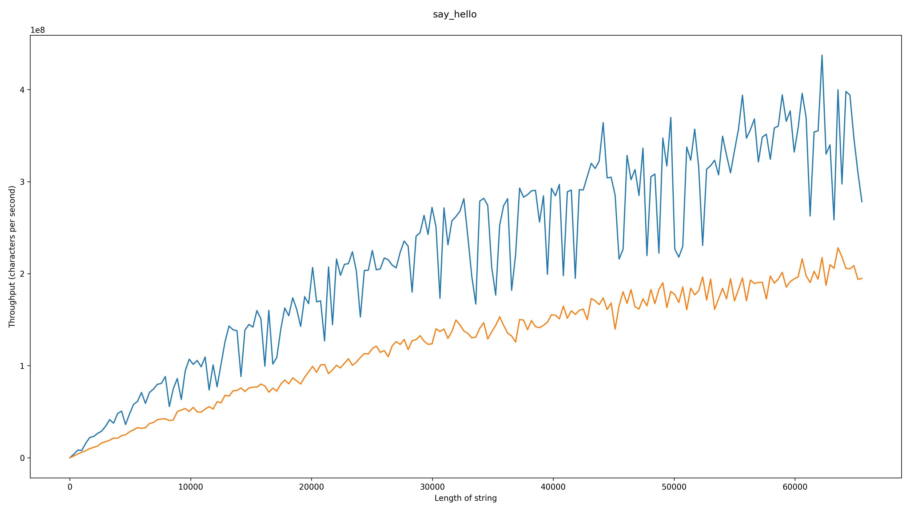
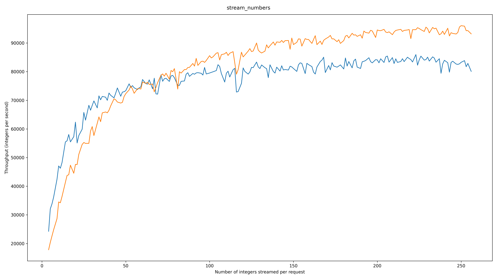

> [!IMPORTANT]
> This project is archived because [grpclib]'s author said there are [no plans for further development](https://github.com/vmagamedov/grpclib/issues/197#issuecomment-2249641932), so performance seems to be less important when choosing which library to use.
> 
> Also, if you are still interested, please check the results in [#2](https://github.com/llucax/python-grpc-benchmark/issues/2), as there are a few improvements to the way things are measured there.

# Python gRPC implementations performance comparison

This repository hosts a simple benchmark comparing [Google's
protobuf/grpc.aio](https://grpc.github.io/grpc/python/) with
[betterproto]/[grpclib].

Fork of https://github.com/llucax/python-grpc-benchmark

## Results

### Unary-Unary `string`

1000 loops

`grpc.aio` speedup: ~2x (len=512), ~1.7x (len=65536)



### Unary-Streaming `i32`s

1000 loops

`grpc.aio` speedup: 1.36x (4 numbers), 0.85x (256 numbers)



## Test conditions

- i5-13600K
- 32GB RAM
- Python 3.11.9
```toml
protobuf = "~5.26.1"
grpcio = "~1.64.1"
grpcio-tools = "~1.64.1"
grpclib = "^0.4.7"
```

- C++ server

## Running the benchmark

- Poetry
- Docker

```console
python3 bench.py build
python3 bench.py run
```